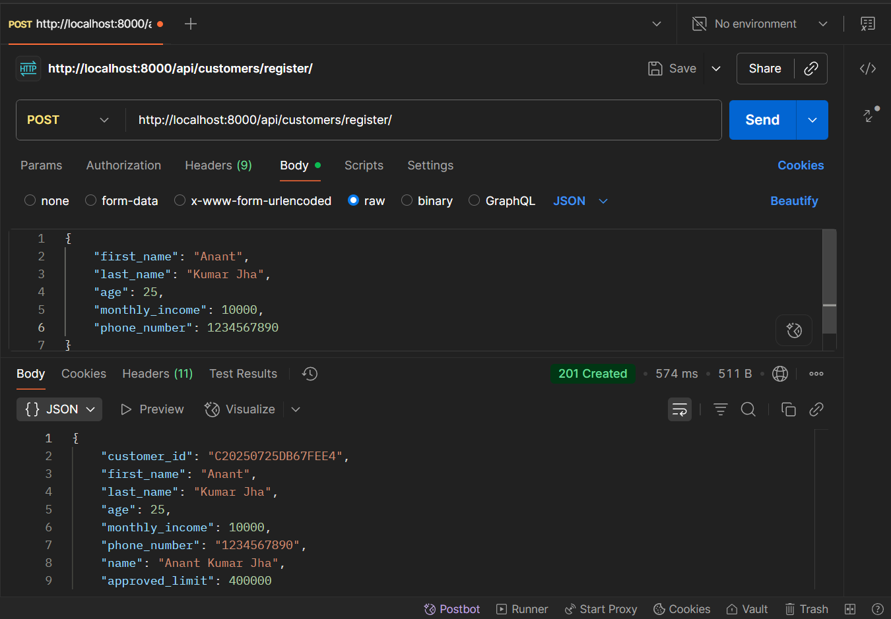
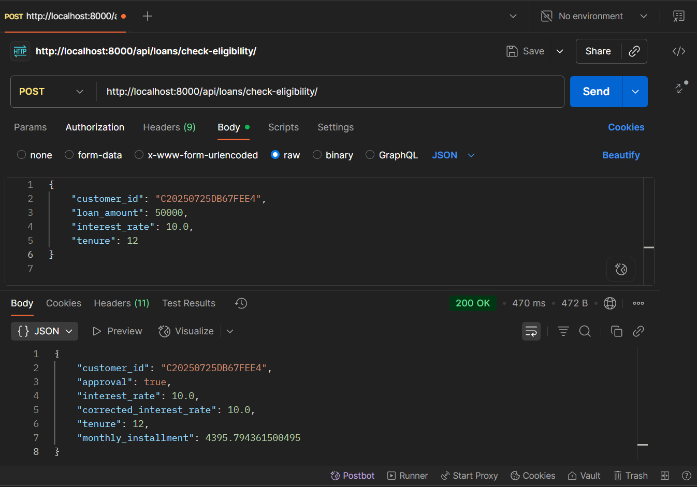
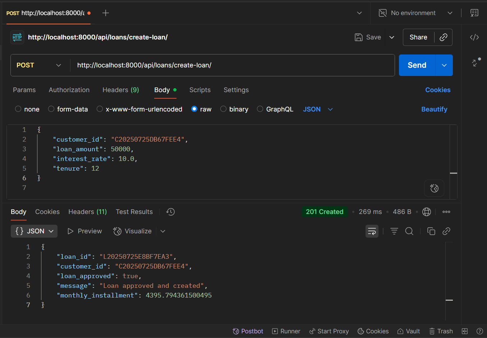
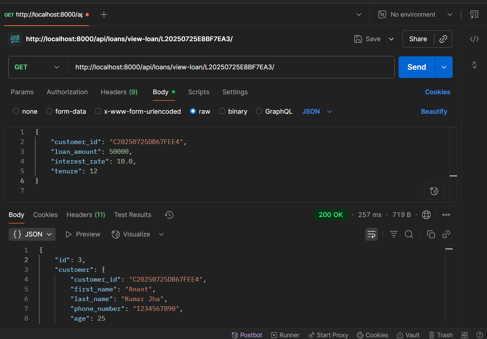
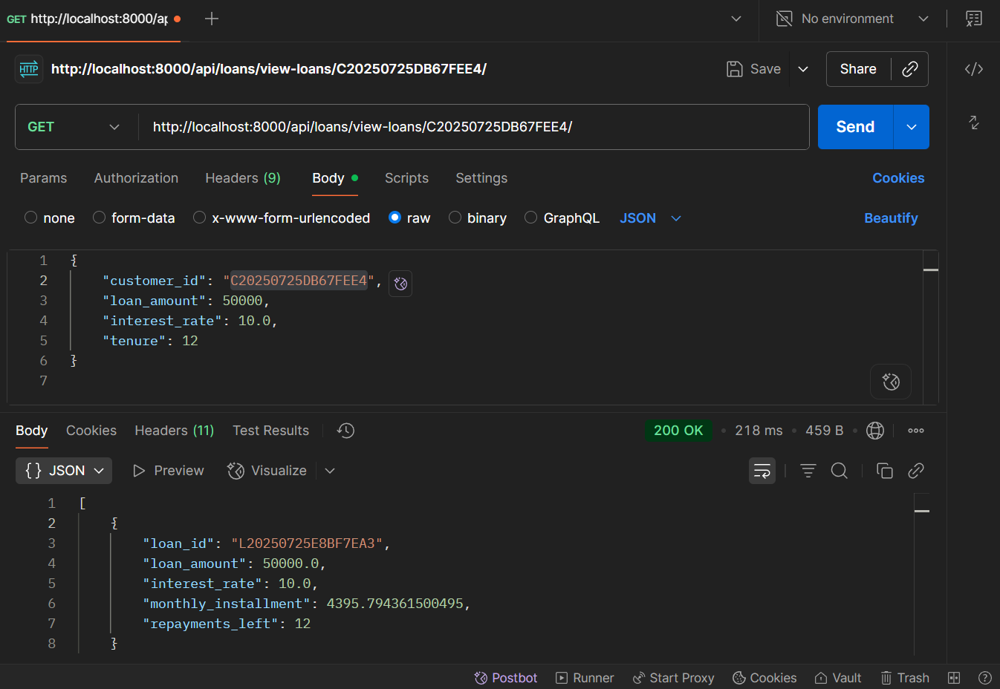

# Credit Approval System

This is a Django-based backend system for credit approval, built with Django REST Framework (DRF). It includes APIs for customer registration, loan eligibility check, loan creation, and viewing loans. Data is ingested from Excel files using Celery for background tasks, and the app is fully dockerized with PostgreSQL.

## Table of Contents

- [Credit Approval System](#credit-approval-system)
  - [Table of Contents](#table-of-contents)
  - [Features {#features-section}](#features-features-section)
  - [Tech Stack {#tech-stack-section}](#tech-stack-tech-stack-section)
  - [Setup and Installation {#setup-and-installation-section}](#setup-and-installation-setup-and-installation-section)
    - [Prerequisites](#prerequisites)
    - [Running the App](#running-the-app)
  - [API Endpoints {#api-endpoints-section}](#api-endpoints-api-endpoints-section)
  - [Testing {#testing-section}](#testing-testing-section)
  - [credit-approval-system/](#credit-approval-system-1)
  
## Features {#features-section}

- **Customer Registration:** POST to register customers with auto-calculated approved_limit (36 * monthly_income, rounded).
- **Loan Eligibility Check:** POST to calculate credit score, apply approval rules, correct interest, and compute compound EMI.
- **Loan Creation:** POST to create loans if eligible, update current_debt.
- **Loan Viewing:** GET to view single loan or all loans for a customer with repayments_left.
- **Background Ingestion:** Automatic loading of `customer_data.xlsx` and `loan_data.xlsx` on startup via Celery.
- **Error Handling:** Validation, status codes (200/201/400/404), custom messages.

## Tech Stack {#tech-stack-section}

- Backend: Django 4.2, Django REST Framework
- Task Queue: Celery with Redis broker
- Database: PostgreSQL (Dockerized)
- Other: openpyxl for Excel, dateutil for dates, math for EMI calculations
- Containerization: Docker & Docker Compose

## Setup and Installation {#setup-and-installation-section}

### Prerequisites

- Docker and Docker Compose installed

### Running the App

1. Navigate to the project directory: `cd credit-approval-system`
2. Build and start: `docker-compose up --build`
3. The app will start at `http://localhost:8000/`, with automatic Excel ingestion (check logs for "ingestion complete")
4. Create superuser for admin: `docker-compose run web python manage.py createsuperuser`
5. Access admin panel: `http://localhost:8000/admin/` (view ingested data in Customers/Loans)

To stop: `docker-compose down`

## API Endpoints {#api-endpoints-section}

All endpoints are under `/api/`. Use Postman or cURL for testing (Content-Type: application/json).

| Endpoint | Method | Description |
|----------|--------|-------------|
| /customers/register/ | POST | Register customer |
| /loans/check-eligibility/ | POST | Check eligibility |
| /loans/create-loan/ | POST | Create loan if eligible |
| /loans/view-loan/<loan_id>/ | GET | View single loan |
| /loans/view-loans/<customer_id>/ | GET | View all loans for customer |

For full API documentation, see the code in `views.py`.

## Testing {#testing-section}

- **Unit Tests:** Run `docker-compose run web python manage.py test` (covers APIs, logic, edge cases)
- **Manual Testing:** Use Postman collection (included in repo as `postman_collection.json`) for all endpoints
- **Edge Cases:** Tested for invalid IDs (404), low credit score rejections (400), no loans (200 with message)

## credit-approval-system/

├── config/ # Global settings, URLs, Celery config
├── customers/ # Customer app (models, views, serializers)
├── loans/ # Loan app (models, views, serializers)
├── excel_data/ # Excel files for ingestion
├── staticfiles/ # Django static files
├── env/ # Virtual environment
├── .env # Environment variables
├── Dockerfile # Docker configuration
├── docker-compose.yml # Docker Compose for app, DB, Redis
├── requirements.txt # Dependencies
├── screenshots/ # API screenshots
├── manage.py # Django entry point
└── README.md # This file

## 📸 Screenshots

### 1. Customer Registration  

**Endpoint:** `/customers/register/`  
**Method:** `POST`  
**Description:** Registers a new customer, calculates `approved_limit` (36 * monthly_income, rounded to nearest lakh), and generates `customer_id`.  

---

### 2. Check Loan Eligibility  

**Endpoint:** `/loans/check-eligibility/`  
**Method:** `POST`  
**Description:** Calculates credit score, applies approval rules, corrects interest rate, and computes monthly EMI (compound interest).  

---

### 3. Create Loan  

**Endpoint:** `/loans/create-loan/`  
**Method:** `POST`  
**Description:** Checks eligibility, creates loan if approved, updates customer's current_debt, and returns `loan_id`.  

---

### 4. View Specific Loan  

**Endpoint:** `/loans/view-loan/<loan_id>/`  
_Example:_ `/loans/view-loan/L20250725DEF456/`  
**Method:** `GET`  
**Description:** Views details of a single loan, including nested customer info.  

---

### 5. View All Loans for Customer  

**Endpoint:** `/loans/view-loans/<customer_id>/`  
_Example:_ `/loans/view-loans/C20250725ABC123/`  
**Method:** `GET`  
**Description:** Lists all loans for a customer, with `repayments_left` (tenure - emis_paid_on_time).  

